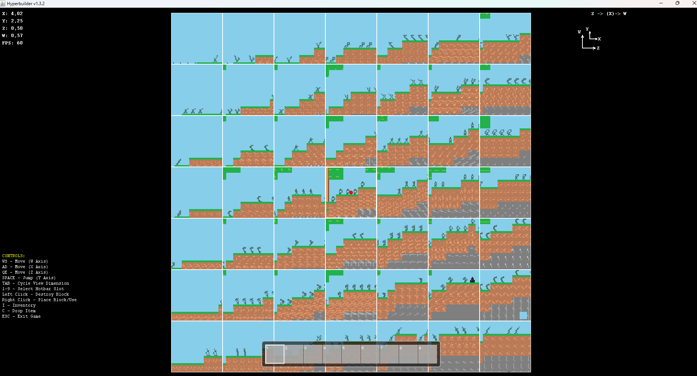
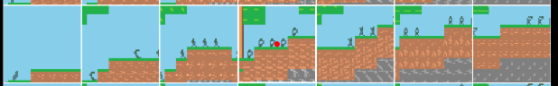

# Hyperbuilder

## Gameplay
This is a 4D game where you can build in 4 dimensions.
The Game is aiming at Sandbox and Survival.
The Game is not yet finished.

## 4 What? 

The Game has 4 Dimensions, meaning that there are 4 different axes that are all independent from one another. 
We as Humans typically live in 3D Space. The 4th Axis would be a new Direction that we cannot perceive or Imagine because it does not exist within in our 3D Space.
In this Game you can move in all 4 Dimensions and build in all 4 Dimensions.

## 4D How?

Since 4D Space is way larger than 3D Space it is difficult or even impossible to represent on a 2D Screen. There will always be a tradeoff.
There are some other games that have attempted to be in 4 Dimensions. This Game tries to do the same but with an unique tradeoff that I have not yet seen often.
The Tradeoff would be high View Distance in exchange for seeing in all 4 Dimensions.
The Game consists of a 2D Grid of 2D Grids. Each 2D Grid is a 2D Plane in 4D Space.

It can be a little confusing I know, but here is a quick run down: 
- You can Jump and Fall: This is the y dimension
- You can walk left and right like in a typical 2d Game, so when you focus on the middle grid where the Player is it appears to be the whole Screen: This is the x Dimension
- You can seamingly teleport one screen up and down to the center block, assuming it is not blocked, but in actuality you just move one unit away: This is the z direction
- Same Story when you teleport one Screen left and right: This is the w direction

## 4D How to better imagine it?

You can't imagine the full picture of 4D Space. But the way I represented it you can get a little closer.
Look at the Picture at the top again: 

You can imagine each Row or Column as a 3D Cube. For example look at the Row in the middle. 

You can imagine taking each 2D Grid and putting it on top of each other.
Then you have a 3D Cube. 
You can do the same for each Row or Column. There are 14 different Possibilities to do this for View Distance 3.
If you combine all 14 different 3D Cubes you get a 4D Cube. That would be the view Distance of the Player: 3 Blocks in all 4 Directions.

## Requirements

You will need to have at least Java 17 installed.
Java: https://www.oracle.com/java/technologies/javase/jdk17-archive-downloads.html
